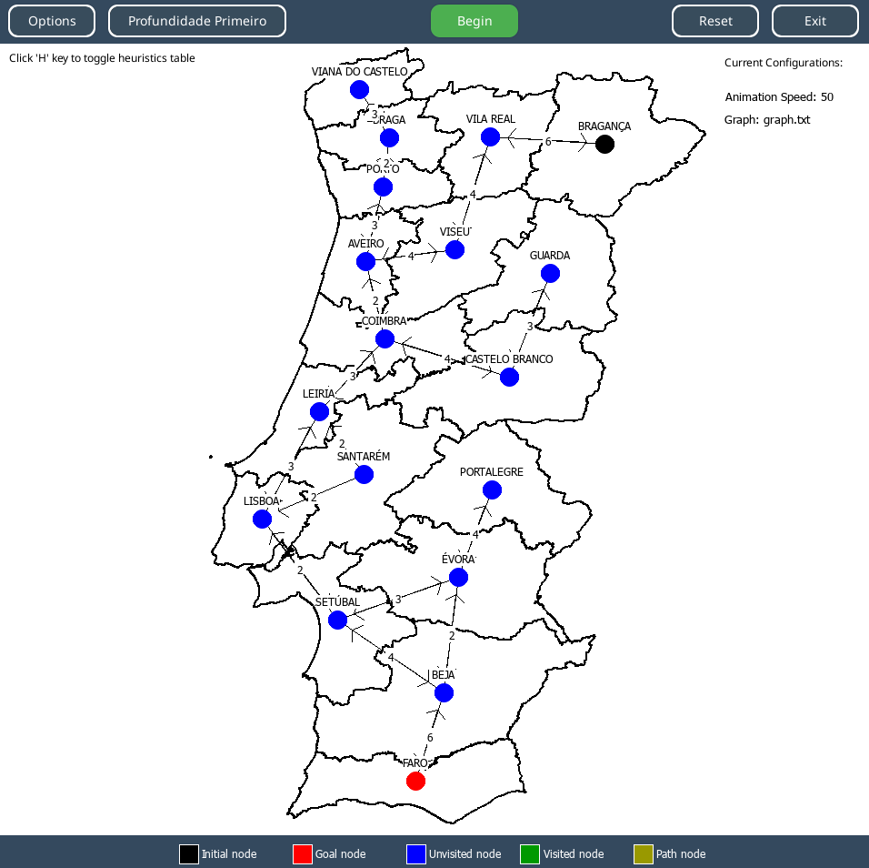

## pyMapz- A Python Graph Traversal Visualizer
*Autores: António Raimundo e Ricardo Pereira*

Código-base para a Unidade Curricular (UC)
de Inteligência Artificial do Iscte-Sintra.



### Download do projeto
Para poderem fazer o _download_ do projeto, deverão seguir as instruções presentes na documentação do código-base. 
Após garantirem que o código-base já se encontra nas vossas máquinas, procedam para o
próximo passo.

### Configuração inicial
Têm de garantir que possuem os seguintes requisitos para poderem importar corretamente
o projeto-base para o vosso IDE (Visual Studio Code / PyCharm):
1. Ter a versão Python 3.13 ou superior instalada nas vossas máquinas.
2. Criar um ambiente virtual específico para este projeto. Para tal,
executem algumas operações:
   1. Atualizem a versão do Python Package Manager (pip): ``pip install --upgrade pip``;
   2. Criação do ambiente virtual (**recomendado**): ``conda create -n NOME_ESCOLHIDO python=3.13``;
   3. Configurar interpretador no VS Code ou PyCharm (se fizeram todos os passos corretamente, deverá aparecer nos vossos IDEs o novo ambiente virtual que criaram).

Após terminarem a configuração inicial, prossigam para mais uns comandos adicionais:

### Comandos iniciais:
Para garantir que o projeto base inicia sem problemas, devem importar o projeto, e no terminal 
(garantir que estão localizados na **pasta principal - pyMapz**)
executem os seguintes comandos:
1. ``pip install -r requirements.txt``
2. ``python -m pip install -e .``

### Ficheiro `algorithms.py`:
Para que o pyMapz possa funcionar corretamente, deverão criar o 
ficheiro ``algorithms.py`` na pasta ``pyMapz/src`` e copiar
para lá o seguinte código:

```python
class Algorithms:
    def __init__(self, graph):
        self.found_path = []
        self.visit_order = []
        self.graph = graph
        self.designations = ['Profundidade Primeiro', 'Largura Primeiro', 'Greedy BFS', 'A*', 'Dijkstra']

    def dfs(self, start_node, end_node):
        return [], []

    def bfs(self, start_node, end_node):
        return [], []

    def greedy_bfs(self, start_node, end_node):
        return [], []

    def a_star(self, start_node, end_node):
        return [], []

    def dijkstra(self, start_node, end_node):
        return [], []

    def perform_search(self, search_type, start_node, end_node):
        match search_type:
            case "Profundidade Primeiro":
                self.visit_order, self.found_path = self.dfs(start_node, end_node)
                return self.visit_order, self.found_path
            case "Largura Primeiro":
                self.visit_order, self.found_path = self.bfs(start_node, end_node)
                return self.visit_order, self.found_path
            case "Greedy BFS":
                self.visit_order, self.found_path = self.greedy_bfs(start_node, end_node)
                return self.visit_order, self.found_path
            case "A*":
                self.visit_order, self.found_path = self.a_star(start_node, end_node)
                return self.visit_order, self.found_path
            case "Dijkstra":
                self.visit_order, self.found_path = self.dijkstra(start_node, end_node)
                return self.visit_order, self.found_path
```